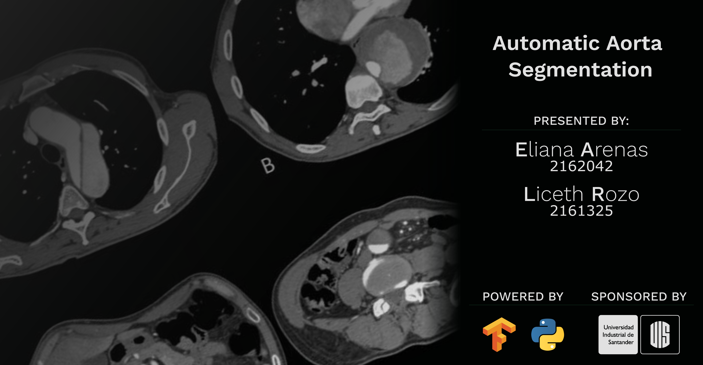
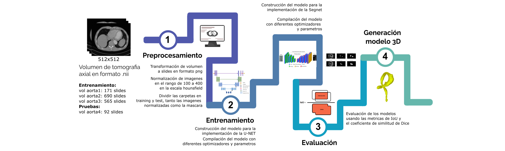

# Aorta-segmentation
Segmentación automatica de aorta

# Objetivos
- Realizar una segmentación automática de aorta, usando técnicas de Deep learning.
- Crear un modelo 3D de la segmentación generada.
- Evaluar distintas arquitecturas de redes neuronales como lo son la Segnet y la Unet.

Video: https://youtu.be/YHSMqp8ORF8
codigo: https://github.com/LicethYaneth/Aorta-segmentation

Workflow

